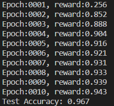

# Policy Gradient for MNIST Image Recognition
## Introduction
This project is a simple implementation for optimizing the neural network with policy gradient.  I built a mnist environment which provides the observation (images), and an agent (neural network). If the agent give the correct answer, the environment gives +1 as reward. However, the environment gives -1 as punishment. The agent will learn the information base on the reward it get. I take the gumbel softmax to do the exploration. The temperture will decay in the training procedure.

## Result
